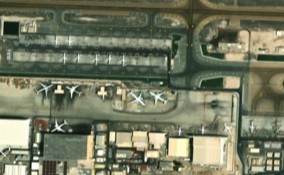
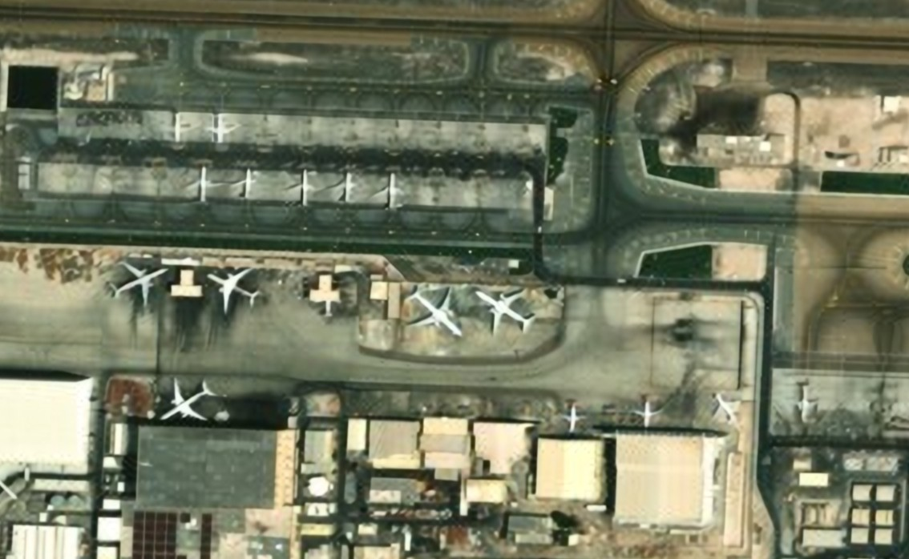

# ImageSuperResolutionCV

## Setup Instructions

### Clone the Repository

First, clone this repository to your local machine.

### Windows Setup

#### Backend Setup

1. Open a command prompt and navigate to the `backend` directory:

    ```bash
    cd backend
    ```

2. Create a virtual environment (ensure Python 3.11 is installed):

    ```bash
    python3 -3.11 -m venv virtualEnv
    ```

3. Activate the virtual environment:

    ```bash
    virtualEnv\Scripts\activate
    ```

4. Install the required libraries (ensure Git Bash is installed):

    ```bash
    sh install.sh
    ```

5. Deactivate and reactivate the virtual environment, then install `basicsr`:

    ```bash
    pip install --no-build-isolation basicsr==1.3.4.9
    ```

    > **Note:** This step ensures `basicsr` is installed after the `torch` module to avoid dependency issues.

6. Modify the `degradations.py` file to fix an import issue:

    ```powershell
    powershell -Command "(Get-Content virtualEnv\Lib\site-packages\basicsr\data\degradations.py) -replace 'from torchvision.transforms.functional_tensor import rgb_to_grayscale','from torchvision.transforms.functional import rgb_to_grayscale' | Set-Content virtualEnv\Lib\site-packages\basicsr\data\degradations.py"
    ```

    > **Note:** This step is done because we are using an old version of basicsr as model relies on it and the import is outdated. It can also be done manually by editing the file.

7. Run the backend server:

    ```bash
    python3 main.py
    ```

#### Frontend Setup

1. Open a separate terminal and navigate to the `frontend` directory:

    ```bash
    cd frontend
    ```

2. Install the required dependencies (ensure `npm` is installed):

    ```bash
    npm install
    ```

3. Start the frontend:

    ```bash
    npm start
    ```

## Using the Application

Once the setup is complete, you can upload a low-resolution satellite image through the website interface. The model will process the image and enhance its resolution.

### Performance Note

- On an **RTX-4060 GPU**, the processing is significantly faster, providing near-instant results.
- On a **CPU**, the process may take approximately **10 minutes** to complete.

 After the model completes processing, the enhanced image will be automatically downloaded to your system.

### Comparison of Low-Resolution and Enhanced Images

Below is an example comparison between a low-resolution satellite image and its enhanced version processed by the model:

| Low-Resolution Image | Enhanced Image |
|-----------------------|----------------|
| {width=300px height=300px} | {width=300px height=300px} |

> **Note:** The images above are for demonstration purposes. Actual results may vary depending on the input image quality and system performance.
